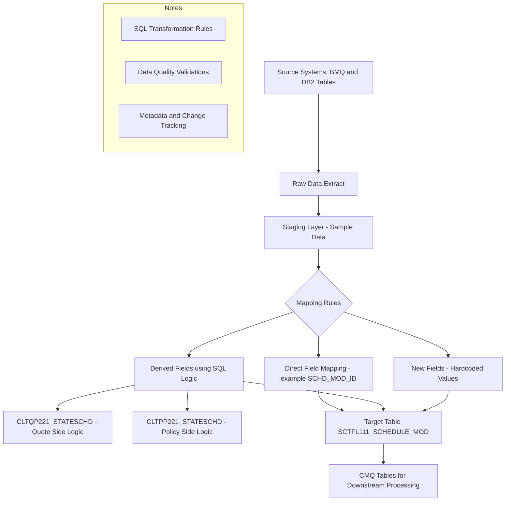

Here’s a **High-Level Design (HLD)** for your mapping document in **Mermaid** syntax. This visual represents how data is mapped and transformed from source systems (like BMQ/DB2) into the target CBD system, including transformation logic and intermediary staging if needed.

---

### ✅ **Mermaid HLD Diagram (Text format for GitHub / Markdown)**

---

### 🔍 Key Concepts from Your Mapping File Visualized:

* **A to B**: Extract raw data from DB2/BMQ.
* **C**: Sample data that helps validate mapping.
* **D**: Core of the Excel – Mapping definitions.
* **E1-E3**: Field classifications: direct, derived, or new.
* **F1-F2**: Transformation logic tables.
* **G**: Final destination in CBD.
* **H**: CMQ is another system that might consume or validate this.
* **I-K**: Captures rules, logic, metadata which are all in your Excel columns.

---

### 📥 Want this in a downloadable format?

I can:

* Generate a **PNG** or **SVG** image
* Create a **Word document** with this diagram embedded
* Provide a **Markdown** file for GitHub documentation

Let me know your preferred format.
